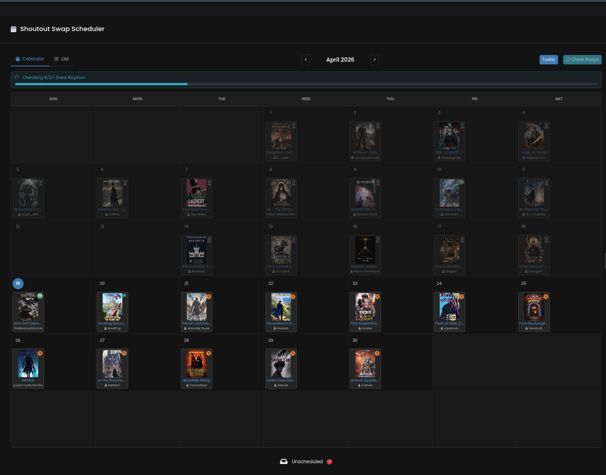
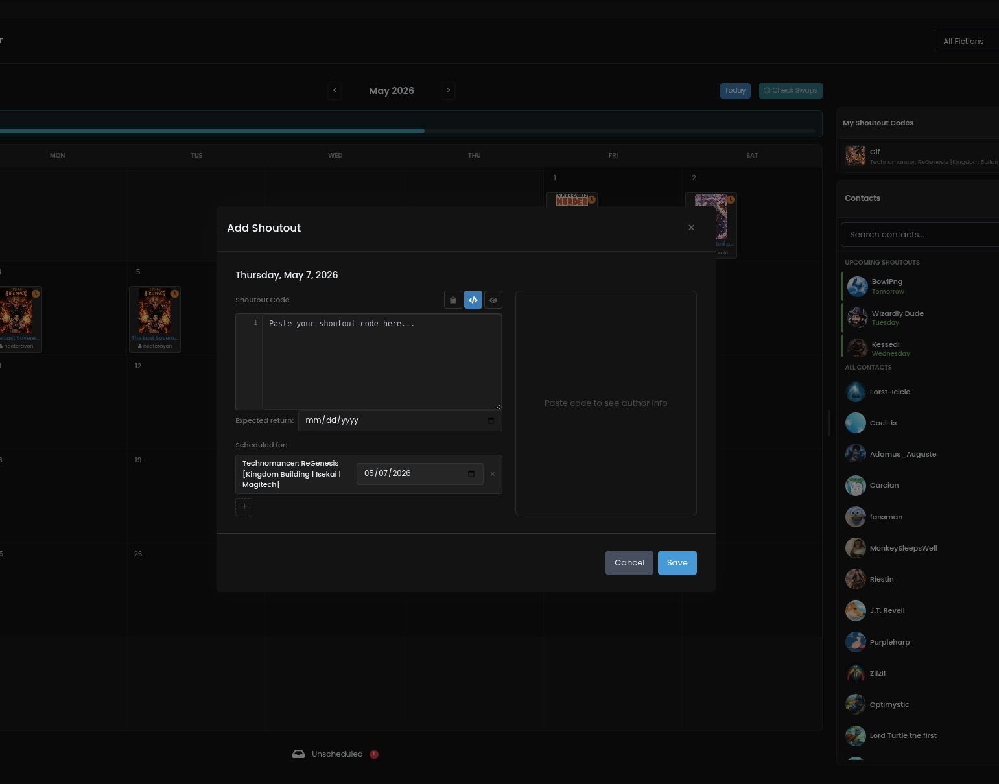
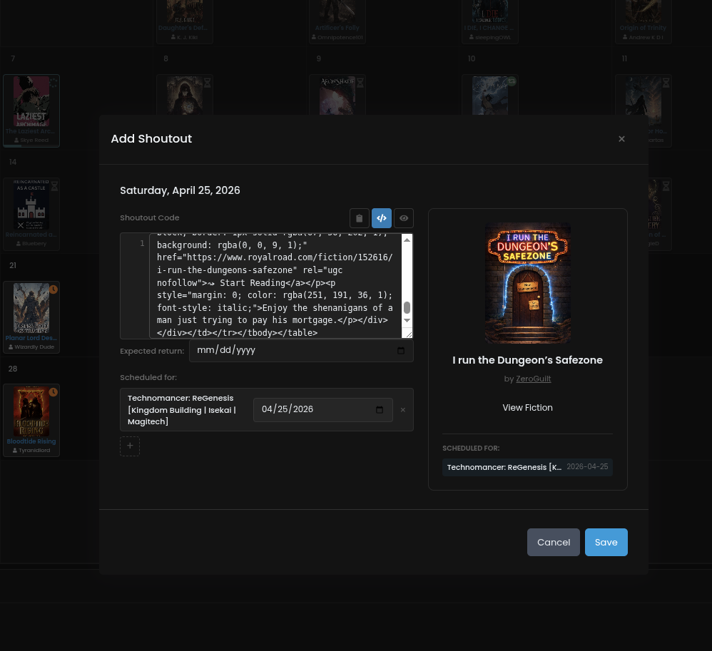
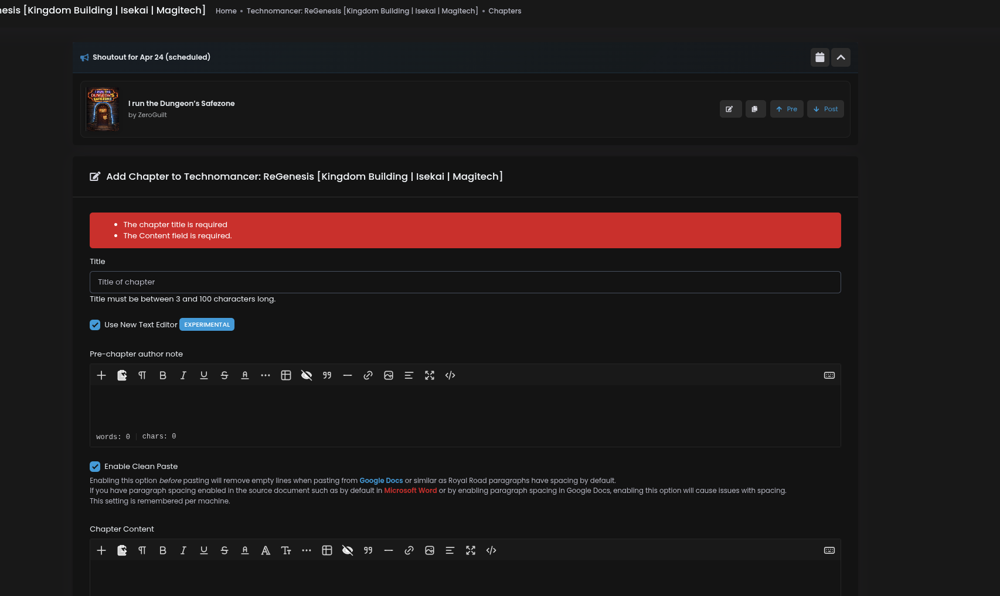

# Author's Companion

A browser extension that gives Royal Road authors a calendar-based shoutout swap scheduler, automatic swap-return tracking, and follower/favorites analytics. Works on Chrome and Firefox.

## Features

- **Swap tracking** — per-fiction status for every outgoing shoutout (swapped / not found / pending scan / scheduled). Scans the other author's chapters and tells you which ones reciprocated; if you posted the same shoutout on two of your fictions, each is tracked independently.
- **Follower + favorites analytics** — daily / hourly / weekly / by-day-of-week / by-hour-of-day charts, with timezone support and CSV export.
- **Drafts integration** — on the chapter editor, a banner lists today's scheduled shoutouts and inserts the code into your pre- or post-chapter note in one click. Auto-archives when the chapter goes live.
- **List view with filter + sort** — every shoutout in one place. Filter by status, post date range, scan age, or specific fictions; sort by newest / oldest / title / reciprocated-first.
- **Calendar scheduling** — drag-and-drop to reschedule, visual deck-of-cards stacking when multiple shoutouts share a date.
- **Import / export** — `.xlsx` (multi-sheet, one per fiction) and `.csv` (single sheet, pick target fiction). Empty template download for newcomers.
- **Everything stays local** — shoutouts live in the browser's IndexedDB. No server, no account, no data leaves your machine.

## Installation

**Chrome Web Store / Firefox Add-ons submissions are in progress.** For now, install manually.

### Chrome / Edge / Brave / other Chromium

1. Grab `authors-companion-v<version>.zip` from [Releases](../../releases).
2. Unzip the file.
3. Open `chrome://extensions`, enable **Developer mode** (top right).
4. Click **Load unpacked** and pick the unzipped folder.

### Firefox

1. Grab `authors-companion-firefox-v<version>.zip` from [Releases](../../releases).
2. **Temporary install (any Firefox)** — open `about:debugging#/runtime/this-firefox` → **Load Temporary Add-on...** → select the zip. Persists until the browser closes.
3. **Permanent install (Firefox Developer Edition or Nightly)** — open `about:config`, set `xpinstall.signatures.required` to `false`. Rename the zip to `.xpi`, drag onto Firefox, confirm the install.

## Building from source

```bash
npm install
./release.sh          # Build + Chrome zip + Firefox zip + GitHub release
./build-firefox.sh    # Just the Firefox build (dist/firefox/ + zip)
npm run build         # Just bundle the JS (dist/)
npm run dev           # Watch mode
npm test              # Playwright suite against a real Chromium + real RR
```

The release script reads the version from `manifest.json` and publishes a GitHub release with both Chrome and Firefox zips as assets. Pass a markdown file as `$1` to use custom release notes (`./release.sh /tmp/notes.md`); the standard Installation block is always appended.

For testing on Firefox during dev, point `about:debugging` at `dist/firefox/manifest.json` after running `./build-firefox.sh` — reload in-place between rebuilds.

## Tutorial

### Calendar



The calendar is where you can schedule shoutouts. Click on an empty date and a modal will appear.

### Adding a Shoutout



Paste a Royal Road fiction link and it will render a preview. You can preview it, then click "Add" to save.

### Shoutout Code



Once saved, the corresponding shoutout code is generated.

### Drafts Integration



Depending on the date, the shoutout code will be available directly from your drafts and you can insert it. The extension also automatically detects when a shoutout has been posted and will archive it.

### Check Swaps

Scan your whole calendar for people who have swapped you back. The scanner looks at the other author's chapters, matches each of your outgoing shoutouts to the fiction you posted it on, and marks each schedule independently — so on a double-shout, one fiction can come back green while the other stays red.

### Drag and Drop

Drag a shoutout from one date to another on the calendar to reschedule it.

### Import / Export

Import and export your shoutout data as `.xlsx` or `.csv`. Only `Date` and `Code` are required — everything else is auto-filled from the shoutout code. An empty template is available in the Export/Import modal so you don't have to guess the format.

### Analytics

Track your fiction's followers and favorites over time. View data in tables (daily, last 24 hours, hourly) or graphs (daily, weekly, by day of week, by hour of day). Supports timezone selection and CSV export.

## Tech Stack

- Preact
- Goober (CSS-in-JS)
- esbuild
- Manifest V3 — Chrome service worker + Firefox event page
